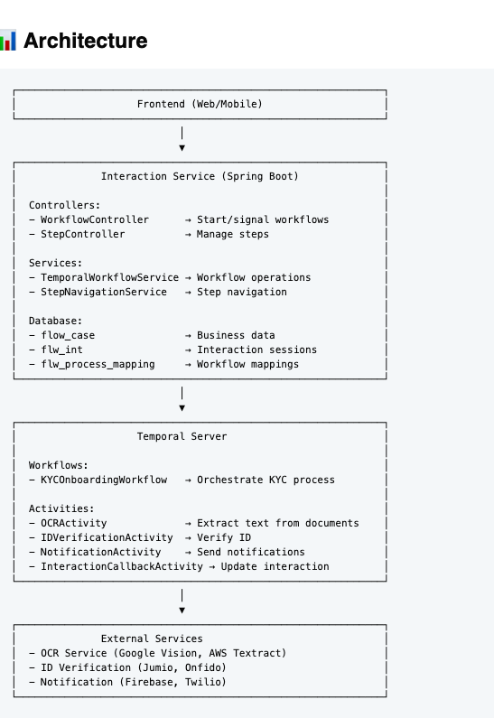

🔄 Workflow thực tế - 3 loại steps hoạt động cùng nhau:
POST /api/interactions/start
**{
"interactionDefinitionKey": "kyc-onboarding",
"userId": "user-456"
}**

**Backend xử lý:**


State sau Step 1:

flw_int_def.steps:     [welcome, personal-info, address-info, ...]  ← BLUEPRINT
flw_int.step_name:     "welcome"                                     ← CURRENT
flw_int.step_status:   "PENDING"
flow_case.steps:       []                                            ← HISTORY (empty)


**Step 2: User submit "welcome" step**
javascript
POST /api/interactions/int-abc-123/submit
{
"stepName": "welcome",
"data": {}
}


State sau Step 2:

flw_int_def.steps:     [welcome, personal-info, ...]  ← BLUEPRINT (unchanged)
flw_int.step_name:     "personal-info"                ← CURRENT (updated)
flw_int.step_status:   "PENDING"
flow_case.steps:       [                              ← HISTORY (appended)
{stepName: "welcome", completedAt: "...", status: "COMPLETED"}
]

**Step 3: User submit "personal-info" step**
POST /api/interactions/int-abc-123/submit
{
"stepName": "personal-info",
"data": {
"fullName": "Nguyen Van A",
"dob": "1990-01-01",
"idNumber": "123456789"
}
}


### **Step 4: Test Workflows**

```bash
# 1. Start KYC Workflow
curl -X POST http://localhost:8080/api/workflows/kyc/start \
  -H "Content-Type: application/json" \
  -d '{
    "caseId": "c1111111-1111-1111-1111-111111111111",
    "interactionId": "int-001",
    "userId": "user-001",
    "initialData": {
      "fullName": "Nguyen Van A",
      "dob": "1990-01-01",
      "idNumber": "123456789"
    }
  }'

# Response:
# {
#   "processInstanceId": "kyc-onboarding-c1111111-1111-1111-1111-111111111111:...",
#   "workflowId": "kyc-onboarding-c1111111-1111-1111-1111-111111111111",
#   "status": "RUNNING"
# }

# 2. Signal: Documents Uploaded
curl -X POST http://localhost:8080/api/workflows/kyc-onboarding-c1111111-1111-1111-1111-111111111111/signal/documents \
  -H "Content-Type: application/json" \
  -d '{
    "id-front": "https://example.com/id-front.jpg",
    "id-back": "https://example.com/id-back.jpg",
    "selfie": "https://example.com/selfie.jpg"
  }'

# 3. Query Status
curl http://localhost:8080/api/workflows/kyc-onboarding-c1111111-1111-1111-1111-111111111111/status

# 4. Query Progress
curl http://localhost:8080/api/workflows/kyc-onboarding-c1111111-1111-1111-1111-111111111111/progress

# 5. Manual Review (if needed)
curl -X POST http://localhost:8080/api/workflows/kyc-onboarding-c1111111-1111-1111-1111-111111111111/signal/manual-review \
  -H "Content-Type: application/json" \
  -d '{
    "approved": true,
    "reason": "All documents verified"
  }'
```

### **Step 5: View in Temporal UI**

Open browser: **http://localhost:8233**

You can see:
- Workflow execution history
- Current state
- Event timeline
- Activity results

---


