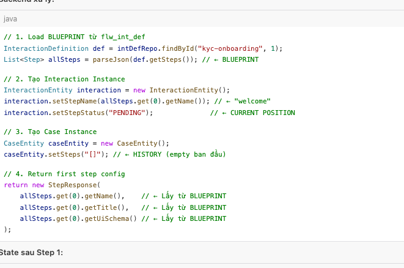
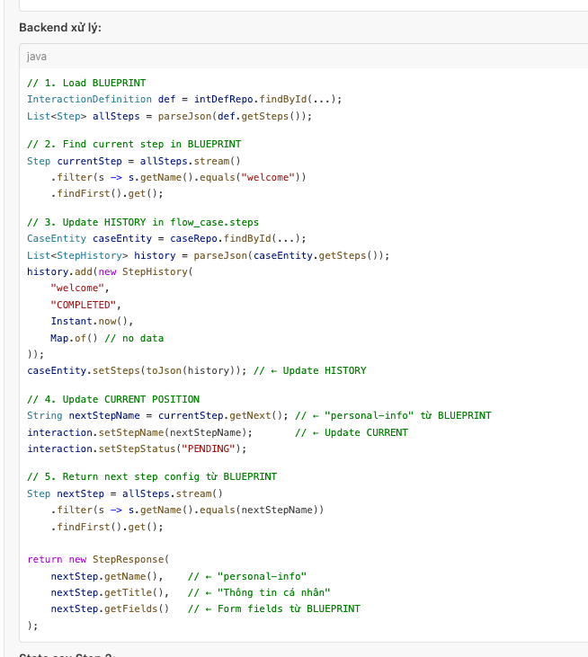
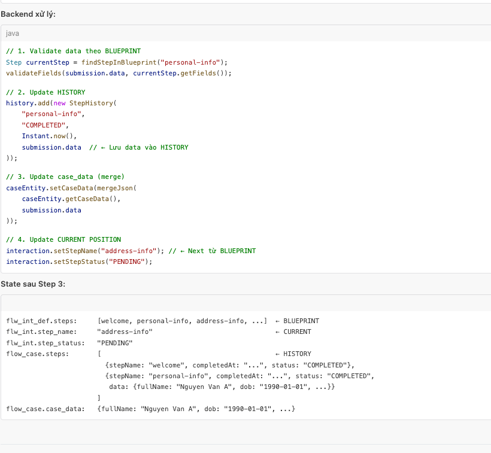
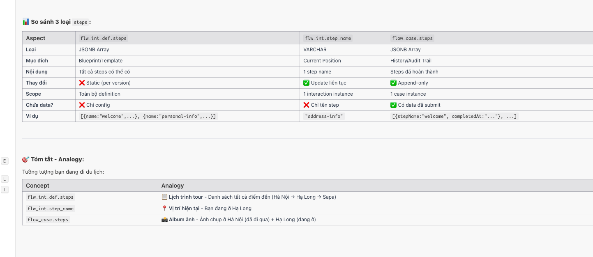
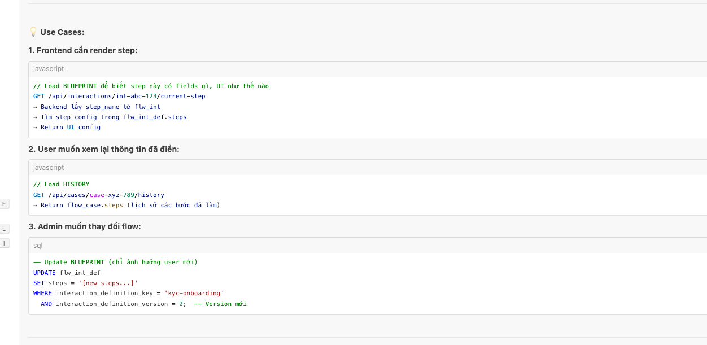

🔄 Workflow thực tế - 3 loại steps hoạt động cùng nhau:
POST /api/interactions/start
**{
"interactionDefinitionKey": "kyc-onboarding",
"userId": "user-456"
}**

**Backend xử lý:**

State sau Step 1:

flw_int_def.steps:     [welcome, personal-info, address-info, ...]  ← BLUEPRINT
flw_int.step_name:     "welcome"                                     ← CURRENT
flw_int.step_status:   "PENDING"
flow_case.steps:       []                                            ← HISTORY (empty)

**Step 2: User submit "welcome" step**
javascript
POST /api/interactions/int-abc-123/submit
{
"stepName": "welcome",
"data": {}
}

State sau Step 2:

flw_int_def.steps:     [welcome, personal-info, ...]  ← BLUEPRINT (unchanged)
flw_int.step_name:     "personal-info"                ← CURRENT (updated)
flw_int.step_status:   "PENDING"
flow_case.steps:       [                              ← HISTORY (appended)
{stepName: "welcome", completedAt: "...", status: "COMPLETED"}
]

**Step 3: User submit "personal-info" step**
POST /api/interactions/int-abc-123/submit
{
"stepName": "personal-info",
"data": {
"fullName": "Nguyen Van A",
"dob": "1990-01-01",
"idNumber": "123456789"
}
}

