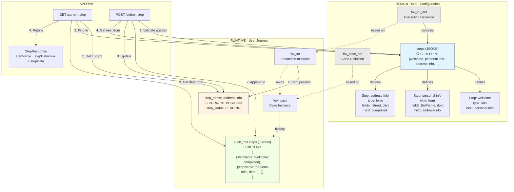

# 3 Types of Steps - Visual Flow

## User Journey Timeline

```
Time: 08:00        08:05              08:10              Now
      │            │                  │                  │
      ▼            ▼                  ▼                  ▼
┌─────────┐  ┌──────────────┐  ┌──────────────┐  ┌──────────────┐
│ welcome │  │personal-info │  │address-info  │  │   waiting    │
└─────────┘  └──────────────┘  └──────────────┘  └──────────────┘
     ✓              ✓                 ✓                 ⏳
  COMPLETED     COMPLETED          COMPLETED         PENDING

┌─────────────────────────────────────────────────────────────┐
│ BLUEPRINT (flw_int_def.steps)                               │
│ [welcome → personal-info → address-info → ... → completed]  │
│                                                             │
│ Defines: All possible steps, UI config, validation         │
└─────────────────────────────────────────────────────────────┘
                            │
                            │ User follows blueprint
                            ▼
┌─────────────────────────────────────────────────────────────┐
│ CURRENT POSITION (flw_int.step_name)                        │
│ Current: "waiting"                                          │
│                                                             │
│ Tracks: Where user is NOW                                  │
└─────────────────────────────────────────────────────────────┘
                            │
                            │ Each completed step saved
                            ▼
┌─────────────────────────────────────────────────────────────┐
│ HISTORY (flow_case.audit_trail.steps)                      │
│ [                                                           │
│   {step: "welcome", time: 08:00, data: {}},                │
│   {step: "personal-info", time: 08:05, data: {...}},       │
│   {step: "address-info", time: 08:10, data: {...}}         │
│ ]                                                           │
│                                                             │
│ Records: What user DID and WHEN                            │
└─────────────────────────────────────────────────────────────┘
```

## Data Flow

```
┌──────────────────────────────────────────────────────────────┐
│                    USER SUBMITS STEP                         │
└──────────────────────────────────────────────────────────────┘
                            │
                            ▼
                ┌───────────────────────┐
                │  StepNavigationService │
                └───────────────────────┘
                            │
        ┌───────────────────┼───────────────────┐
        │                   │                   │
        ▼                   ▼                   ▼
┌──────────────┐    ┌──────────────┐    ┌──────────────┐
│   BLUEPRINT  │    │   CURRENT    │    │   HISTORY    │
│              │    │   POSITION   │    │              │
│ Validate     │    │ Update to    │    │ Append new   │
│ data against │    │ next step    │    │ entry with   │
│ field rules  │    │              │    │ submitted    │
│              │    │ flw_int      │    │ data         │
│ flw_int_def  │    │ .step_name   │    │              │
│ .steps       │    │              │    │ flow_case    │
│              │    │              │    │ .audit_trail │
└──────────────┘    └──────────────┘    └──────────────┘
        │                   │                   │
        └───────────────────┼───────────────────┘
                            │
                            ▼
                ┌───────────────────────┐
                │   Return next step    │
                │   configuration to    │
                │   frontend            │
                └───────────────────────┘
```

## Database Schema Relationship

```
┌─────────────────────────────────────────────────────────────┐
│ flw_int_def (Interaction Definition)                        │
├─────────────────────────────────────────────────────────────┤
│ PK: interaction_definition_key, version                     │
│ - case_definition_key                                       │
│ - schema_id                                                 │
│ - steps: JSONB ◄─────────────────── 📋 BLUEPRINT            │
│   [                                                         │
│     {name, type, title, fields, next, onSubmit, ...},      │
│     ...                                                     │
│   ]                                                         │
└─────────────────────────────────────────────────────────────┘
                            │
                            │ 1:N
                            ▼
┌─────────────────────────────────────────────────────────────┐
│ flw_int (Interaction Instance)                              │
├─────────────────────────────────────────────────────────────┤
│ PK: id                                                      │
│ FK: interaction_definition_key, version                     │
│ - user_id                                                   │
│ - case_id                                                   │
│ - step_name: VARCHAR ◄────────────── 📍 CURRENT POSITION    │
│ - step_status                                               │
│ - status                                                    │
│ - resumable                                                 │
└─────────────────────────────────────────────────────────────┘
                            │
                            │ 1:1
                            ▼
┌─────────────────────────────────────────────────────────────┐
│ flow_case (Case Instance)                                   │
├─────────────────────────────────────────────────────────────┤
│ PK: id (UUID)                                               │
│ FK: case_definition_key, version                            │
│ - customer_id                                               │
│ - current_step                                              │
│ - status                                                    │
│ - case_data: JSONB (merged data from all steps)            │
│ - audit_trail: JSONB ◄──────────────── 📸 HISTORY           │
│   {                                                         │
│     "steps": [                                              │
│       {stepName, status, startedAt, completedAt, data},    │
│       ...                                                   │
│     ]                                                       │
│   }                                                         │
│ - sla: JSONB                                                │
│ - created_at, updated_at                                    │
└─────────────────────────────────────────────────────────────┘
```
